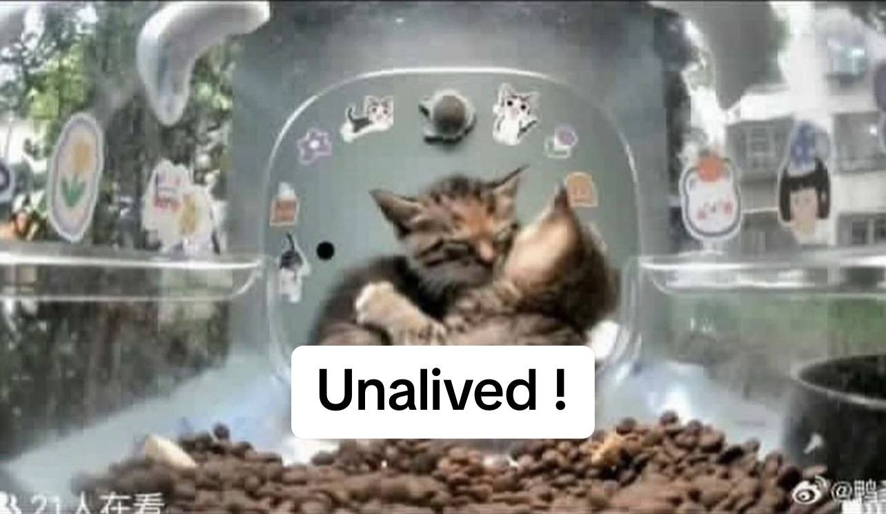

# Urge China to introduce anti-abuse laws

_Even if you're not a big fan of animals, please consider supporting this cause as this affects society as a whole._

China's situation with animal welfare, especially for cats, is deeply troubling. China does not have good enough laws in place to prevent and punish animal abusers, this means abuse often goes unchecked. **This urgent issue demands immediate action.**

People are increasingly vocal and are currently demanding laws that offer genuine protection. The need for change has never been more critical, and it's crucial we rally together now to ensure animals are safeguarded.

## What's happening now?

A popular internet cat named **Mr. Fresh**, known for his appearances on a 24/7 livestream app "[Hello Street Cat](https://streetcat.wiki/)," became the target of a disturbing bounty. A group associated with animal abuse offered cryptocurrency for proof of Mr. Fresh's death.

These types of groups have already killed and abused **several other cats and kittens** that used to appear frequently on Hello Street Cat. Mr. Fresh has helped bring attention to this issue because of his popularity.

Cats on Hello Street Cat are not the only victims, there are and have been countless others that we don't even see.

## Abusive actions and their victims

 

 

 

## How can I help stop abuse?

There are many people advocating and providing resources. Here are just a few:

- [@feline_guardians on Instagram](https://www.instagram.com/feline_guardians)
- Change.org general petition: [Click Here](https://www.change.org/p/urgent-call-to-put-a-stop-to-unprecedented-levels-of-cruelty-torture-to-animals-in-china)
- The OIPA's petition: [Click Here](https://www.oipa.org/international/cats-tortured-and-killed-online-china/)
- Actions individuals like you can take to take down abuse gangs: [Click Here](https://telegra.ph/Actionables-to-Take-Down-Cat-Abuse-Gang-09-20)
- The main hub for information, petitions, and actions: [savecatsinchina](https://sites.google.com/view/savecatsinchina/take-action)
- Feline Guardians' LinkTree: [fguardianswithoutborders](https://linktr.ee/fguardianswithoutborders)

Please take just a little bit of time to complete at least a couple petitions. Most of them are quick.

## Add your info

Edit these lines so that they use your information:
- [Author](index.html#23) line 23
- [URL](index.html#29) line 29
- [Twitter @](index.html#36) line 36
- [URL](index.html#37) line 37

## Disclaimer

This website does use completely anonymous analytics powered by Umami. I want to be as transparent as possible with this. Here's a list of things that are tracked:
- Specific information
  - Basic User Agent info
  - Country
  - Referrer
- General information (averaged out or counted across all visitors)
  - Visitor count
  - Average visit time
  - Bounce rate
  - Views

I included comments in the [index.html](index.html) file if you'd like to remove the analytics. The only purpose is to track how well the page is doing and it's spread <3
